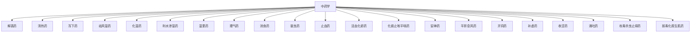

# 中药学知识库

> [!tip] 四气五味，归经升降；君臣佐使，各有所长。

这里是「溯本医源」的中药学知识库。按教材分类整理每一味中药，随学随记，支持全站搜索（按 `Ctrl+K` 输入药名、性味、功效即可查到）。

## 中药分类总览



## 如何添加一味中药

1. 在 Obsidian 中进入 `docs/中药学/<分类>/`，新建笔记，例如「麻黄.md」
2. 按下面的模板填写：性味归经、功效、主治、用法用量、禁忌、现代药理、个人见解
3. 保存后发布，笔记会自动出现在左侧「中药学 → 对应分类」下，并且可以被搜索

## 中药笔记模板

````markdown
---
title: 药名
分类: 解表药
tags: [中药学]
---

# 药名

> [!info] 速记
> 一句话记住这味药

## 性味归经
- 性味：
- 归经：

## 功效
- 

## 主治
- 

## 用法用量
- 

## 禁忌
- 

## 现代药理
- 

## 个人见解
> [!tip] 我的理解
> 结合临床、方剂或生活经验写下自己的体会
````